<div align="center">
  
  <h1>Roombai</h1>
  <p><strong>Your coding agents. A room full of roombas.</strong></p>
  <p>A tiny, playable pixel-art room that lives on your desktop.<br />Watch your agents work, spot the ones that need you, and clean up their mess.</p>
  <p>
    <a href="LICENSE"></a>
    
    
  </p>
  <p><a href="#get-started">Get started</a> · <a href="#a-room-for-every-project">Take a tour</a> · <a href="#integrations">Integrations</a> · <a href="#development">Contribute</a></p>
  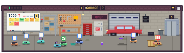
  <p><em>More work, more mess. Finish a task, get a little confetti.</em></p>
</div>

## What is Roombai?

Roombai turns your running coding agents into little robot vacuums in an always-on-top desktop room. Each project gets its own space, and the Garage brings everyone together. Agent activity makes a mess; finishing work lets the room settle down.

- **See who needs you.** Working, waiting, stuck, done, and idle agents have distinct behavior, with desktop notifications for important changes.
- **Start without configuration.** Discover recent local Codex and Claude Code sessions, including supported t3code sessions.
- **Keep work in view.** A rotating whiteboard holds tasks, GitHub issues, and pull requests.
- **Play while you wait.** Throw roombas, scrub furniture, pick up laundry, and send tired agents to recharge.
- **Make yourself at home.** Move the room between displays, change its size, mute alerts, or roll it up into its roof.

Roombai watches your agents. It does not submit prompts or run tasks on their behalf.

## Get started

For a source checkout, use **Node.js 22**, npm, and Git. Node.js 22 is also used by the release workflow.

```bash
git clone https://github.com/latinrev/roombai.git
cd roombai
npm ci
npm start
```

Want to explore without running an agent?

```bash
npm run demo
```

The demo supplies pretend agents that change state while you play with the room.

Installer builds belong on the [Releases page](https://github.com/latinrev/roombai/releases). If no release has been published yet, use the source instructions above. Packaging targets are Windows installer/portable EXE, macOS universal DMG, and Linux AppImage/DEB. The release workflow currently builds unsigned packages; cross-platform packaging configuration is not a guarantee that every desktop environment has been tested.

## A room for every project

Each project directory produces a consistent room, with its own wallpaper, flooring, rug, windows, wall art, and furniture. Rooms can feel like a living room, bedroom, office, or studio.

<table>
  <tr>
    <td>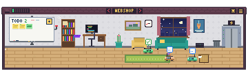</td>
    <td>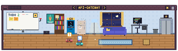</td>
  </tr>
  <tr>
    <td>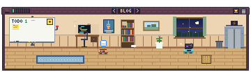</td>
    <td>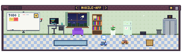</td>
  </tr>
</table>

The **Garage** is always first and collects agents and todos from every project. Click the roof sign to select a room, or use the arrows to switch. An arrow blinks red when another room needs your attention. Each room remembers its dirt, damaged furniture, and loose junk between runs.

### Work makes a mess

<table>
  <tr><th>A little peace and quiet</th><th>A busy day with agents</th></tr>
  <tr>
    <td>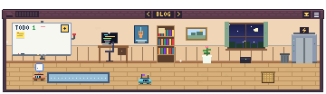</td>
    <td>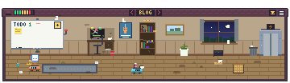</td>
  </tr>
</table>

New activity drops junk onto the floor and wears out furniture. Bookshelves snap, TVs crack, couches lose their springs, and fridges grow things they probably shouldn't. Roombas vacuum floor dirt; drop one on furniture to scrub it back to new. Working agents scrub fastest.

Messy rooms attract flies, cobwebs, and grime. Clean rooms get flowers and sparkles. The window follows your local time of day.

### One whiteboard, three faces

Turn the red crank beside the board, or click its title, to rotate between views.

<table>
  <tr><th>TODO</th><th>ISSUES</th><th>PRS</th></tr>
  <tr>
    <td align="center">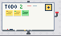</td>
    <td align="center">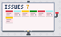</td>
    <td align="center">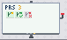</td>
  </tr>
  <tr>
    <td>Agent work and your own persistent sticky notes.</td>
    <td>Open issues, label colors, and comment indicators.</td>
    <td>Open pull requests, CI status, reviews, and drafts.</td>
  </tr>
</table>

Hover a note for details. Click or double-click GitHub notes to open them on GitHub. The Garage combines boards across projects. GitHub views use your existing `gh` login and do not modify issues or pull requests.

### Attention, without the tab juggling

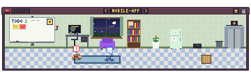

| State | What it means |
| --- | --- |
| Working | A turn is in progress; the roomba moves around the room. |
| Needs you | A tool has waited about 90 seconds without a result, or a supported hook reports an approval request. |
| Stuck | An error was detected, or an open turn has gone quiet for about six minutes. |
| Done | Confetti and a notification. Acknowledge the agent to send it to nap. |
| Idle | Resting at the dock; inactive agents leave after about 90 minutes. |

Transcript-based waiting and stuck detection are heuristics: a slow tool can look like an approval wait. Optional Claude Code hooks improve approval detection.

### A roof when you need the space


Roll up the room when you want more screen space. Its position and settings are remembered.

## Controls and little distractions

| Action | Result |
| --- | --- |
| Drag the roof | Move the room, including between displays. |
| Click the roof sign / room arrows | Choose a project or visit the Garage. |
| Drag and throw a roomba | Toss it around; a good throw can stick it to the ceiling. |
| Drop a roomba on furniture | Clean and repair that piece of furniture. |
| Drag laundry or trash | Put it in the basket or bin, or drop it onto a roomba. |
| Hover an agent or sticky note | See details about its work. |
| Click an agent | Pin its detail card. |
| Use **Jump to it** | Open the supported host, or copy a terminal resume command. |
| Click the yellow **+** | Add a personal todo; mark it done or toss it later. |
| Right-click an agent / choose **Shoo** | Send it to the recharge station until it starts working again. |
| Use the tray or room menu | Adjust placement, size, sound, and window behavior. |

<p>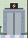</p>

Codex roombas use greens and teals, Claude roombas use corals and oranges, and custom agents use purples. t3code threads get a purple flag. Some roombas will eat your trash. Others will wear it as a hat.

## Integrations

### Local agent discovery

Roombai looks for transcript files modified within the last 12 hours and follows new events.

| Agent source | Local transcript location |
| --- | --- |
| Codex CLI and integrations writing Codex session logs | `~/.codex/sessions/YYYY/MM/DD/*.jsonl` |
| Claude Code CLI, SDK, and integrations writing Claude logs | `~/.claude/projects/*/*.jsonl` |
| Other tools | Send events to the local HTTP endpoint below. |

Host detection and **Jump to it** support paths for t3code, the Codex desktop app, VS Code, and terminal sessions. Discovery depends on the host writing a supported transcript format.

### GitHub issues and pull requests

Install the GitHub CLI and sign in:

```bash
gh auth login
```

A project needs a GitHub `origin` remote for its board to find the repository. The app uses Git and `gh` for read-only lookups and caches results. Agent watching works without this integration.

### Custom agents

While Roombai is running, send JSON to `http://127.0.0.1:47770/event`:

```bash
curl -X POST http://127.0.0.1:47770/event \
  -H "Content-Type: application/json" \
  -d '{"id":"build-42","title":"Nightly build","project":"infra","status":"working"}'
```

In PowerShell:

```powershell
$event = @{ id = 'build-42'; title = 'Nightly build'; project = 'infra'; status = 'working' }
Invoke-RestMethod -Method Post -Uri http://127.0.0.1:47770/event `
  -ContentType 'application/json' -Body ($event | ConvertTo-Json)
```

Reuse the same `id` to update an agent. Supported statuses are `working`, `waiting`, `stuck`, `done`, and `idle`. `GET http://127.0.0.1:47770/` returns the current agent snapshot.

<details>
<summary><strong>Optional Claude Code hooks for more precise approval alerts</strong></summary>

Merge these entries into your existing `~/.claude/settings.json`; preserve any hooks you already use. The commands require `curl` on your path.

```json
{
  "hooks": {
    "UserPromptSubmit": [{ "hooks": [{ "type": "command", "command": "curl -s -m 1 -X POST --data-binary @- http://127.0.0.1:47770/hook/claude" }] }],
    "Notification": [{ "hooks": [{ "type": "command", "command": "curl -s -m 1 -X POST --data-binary @- http://127.0.0.1:47770/hook/claude" }] }],
    "PreToolUse": [{ "hooks": [{ "type": "command", "command": "curl -s -m 1 -X POST --data-binary @- http://127.0.0.1:47770/hook/claude" }] }],
    "Stop": [{ "hooks": [{ "type": "command", "command": "curl -s -m 1 -X POST --data-binary @- http://127.0.0.1:47770/hook/claude" }] }]
  }
}
```

</details>

## Local data and privacy

Transcript processing happens locally. Roombai reads session information including project paths and task text to populate the room and detail cards. Room state, todos, and window settings live in Electron's per-user application data directory as `rooms.json`, `todos.json`, and `window.json`.

The event server binds to `127.0.0.1`, not a public network interface. It has no authentication, and its snapshot includes agent details, so keep it local. GitHub boards make network requests through your authenticated GitHub CLI; opening external links hands them to your system browser or supported app.

## Development

The app uses Electron with a plain JavaScript canvas renderer. There is no frontend framework or renderer compilation step.

| Path | Purpose |
| --- | --- |
| `src/main.js` | Desktop window, tray, persistence, notifications, and host handoff. |
| `src/preload.js` | Bridge between Electron and the renderer. |
| `src/watcher.js` | Transcript discovery, agent states, hooks, and local event server. |
| `src/github.js` | GitHub CLI integration for issues and pull requests. |
| `src/renderer/` | Pixel-art room, furniture, interactions, fonts, and sound. |
| `site/` | Static landing page, screenshots, fonts, and playable browser demo. |
| `scripts/` | Electron launcher and browser-demo synchronization. |
| `test/` | Developer interaction and screenshot scripts. |
| `.github/workflows/release.yml` | Tagged-release builds for three operating systems. |

### Useful commands

```bash
npm start           # Watch real local agents
npm run demo        # Run with simulated agents
npm run site        # Copy the current renderer into the website demo
npm run dist:win    # Build Windows packages
npm run dist:mac    # Build a macOS package
npm run dist:linux  # Build Linux packages
```

Build packages on the matching operating system, or use the release workflow. Build output goes into ignored `dist/`. Pushing a version tag such as `v0.1.0` triggers the existing workflow and attaches packages to a GitHub Release.

The landing page can be served by any static HTTP server with `site/` as its root. Run `npm run site` after renderer changes; it updates the copied app files while retaining the demo bridge. Download destinations are configured in `site/site.js`.

### Developer checks

The scripts under `test/` drive the live renderer and capture interactions; they are not an automated assertion suite. For example, from PowerShell:

```powershell
$env:ROOM_SHOT = 'shot-menu.png'
$env:ROOM_SCRIPT = 'test/menu.js'
$env:ROOM_SHOT_DELAY = '15000'
npm run demo
Remove-Item Env:ROOM_SHOT, Env:ROOM_SCRIPT, Env:ROOM_SHOT_DELAY
```

Screenshot runs use a separate temporary application-data directory. Inspect the captured image and console output. There is currently no `npm test` command.

### Contributing

Bug reports and pull requests are welcome. For bugs, include your operating system, agent host, reproduction steps, and a screenshot when helpful. Remove private task text and paths before sharing logs or images.

For changes, keep the scope focused, exercise the affected behavior in the app, and include before/after screenshots for visual changes. If you change the renderer, regenerate the site demo with `npm run site`.

## Sponsorship

Roombai is free and open source. The landing page includes sponsor-placement placeholders; paid checkout and automatic sponsor publishing are not implemented yet. Sponsorship does not unlock app features.

## License

[MIT](LICENSE) · Copyright (c) 2026 latinrev.

The bundled website fonts retain their SIL Open Font License: [Pixelify Sans](site/fonts/PixelifySans-OFL.txt) and [Atkinson Hyperlegible](site/fonts/AtkinsonHyperlegible-OFL.txt).
